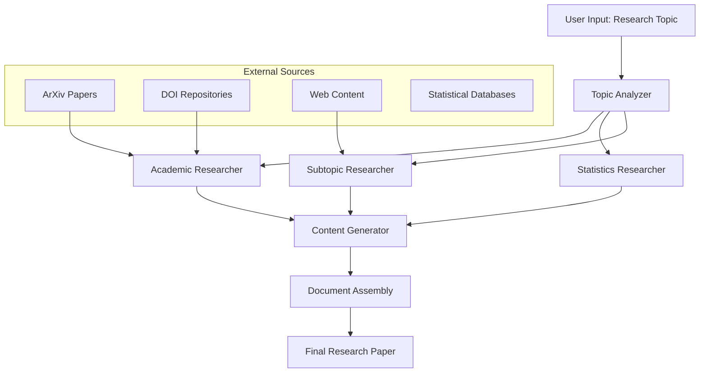
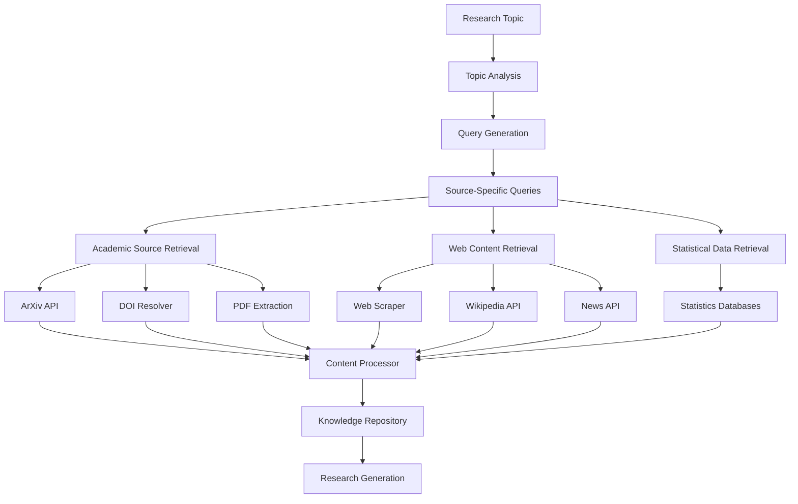

<a name="top"></a>
[](https://algonet.open-research.tech/)
[](https://python.org)
[](#)
[](#-license)

⭐ Star us on GitHub

## Table of Contents

- [About](#about)
  - [What is OrcaStatLLM Researcher?](#orcastatllm-researcher)
  - [OrcaStatLLM Architecture](#orcastatllm-architecture)
  - [Information Retrieval Process](#retrieval-architecture)
- [Installation](#installation)
  - [Prerequisites](#prerequisites)
  - [Setup Guide](#setting-up)
- [Examples & Demos](#examples--demos)
- [Contributing](#contributing)
- [License](#license)
- [Contact & Support](#contact--support)

<br/><br/>

# About

## OrcaStatLLM Researcher

OrcaStatLLM Researcher is a self-contained research system that employs a multi-agent architecture powered by large language model. It orchestrates information gathering from academic repositories, statistical databases, and web sources, and then applies natural language processing for content filtering, relevance ranking, and knowledge synthesis. The system follows a modular pipeline architecture with specialized components for academic paper analysis, statistical data extraction, and visualization generation. Operating either as a fully autonomous agent or interactive research aide, it produces semantically rich documents with proper citation management and data visualization, leading to significant productivity improvement in research workflows without compromising stringent academic rigor.

## OrcaStatLLM Architecture


## Retrieval Architecture

The retrieval system operates through specialized modules that target different information sources:



# Installation
This guide will help you get up and running with OrcaStatLLM in minutes.

## Prerequisites

- Gemini API Key (Can be retrived from https://aistudio.google.com/)
- Google CSE API Key (https://console.cloud.google.com/apis/dashboard)
``` yaml
Step-1: Create a Custom Search Engine on https://cse.google.com
Step-2: Add Those on config.json

//

//

```
- Python 3.11 or higher
```bash
$ sudo apt install python3.11
```
- Dependecy for Playwright to Work Perfectly
``` bash
$ sudo apt-get update && apt-get install -y build-essential libpq-dev curl libglib2.0-0 libnss3 libnspr4 libdbus-1-3 libatk1.0-0 libatk-bridge2.0-0 libcups2 libxcomposite1 libxdamage1 libxext6 libxfixes3 libxrandr2 libgbm1 libxkbcommon0 libpango-1.0-0 libcairo2 libasound2 libatspi2.0-0 libpangocairo-1.0-0 libpangoft2-1.0-0 libgdk-pixbuf2.0-0 && apt-get clean

```
- Playwright
```
$ sudo pip install playwright
$ playwright install chromium
```
- Pandoc (For PDF Generation)

```bash
$ sudo apt install Pandoc
```

## Setting Up

```
$ git clone https://github.com/AlgoNetLab/OrcaStatLLM-Researcher
$ cd OrcaStatLLM-Researcher
$ pip3 install -r requirements.txt
$ python3 run.py 
```

# Example and Demos

## Generated Papers

<p>
  <a href="./examples/papers/Quantum_Computi_6110.pdf">
    
  </a> &nbsp;&nbsp;&nbsp;&nbsp;&nbsp;&nbsp;&nbsp;&nbsp;&nbsp;
  <a href="examples/papers/Development_and_7336.pdf">
    
  </a>&nbsp;&nbsp;&nbsp;&nbsp;&nbsp;&nbsp;&nbsp;&nbsp;&nbsp;
  <a href="examples/papers/Windows_Vulnera_4616.pdf">
    
  </a>
  <br>
</p>

## Demo Video


    
