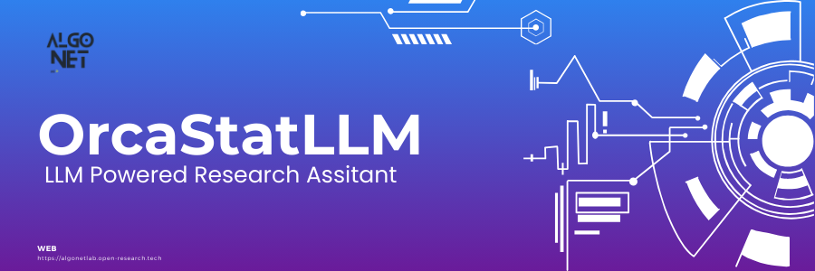
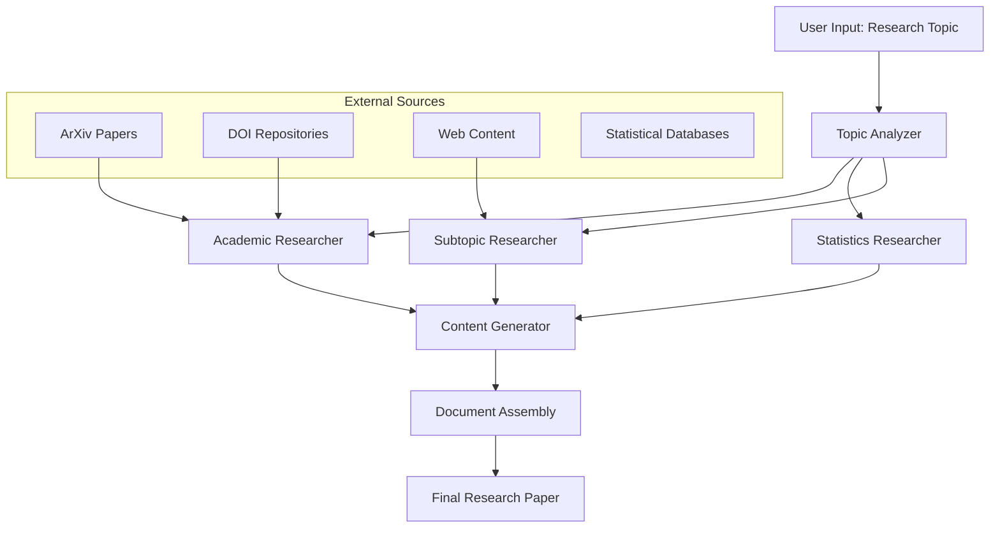
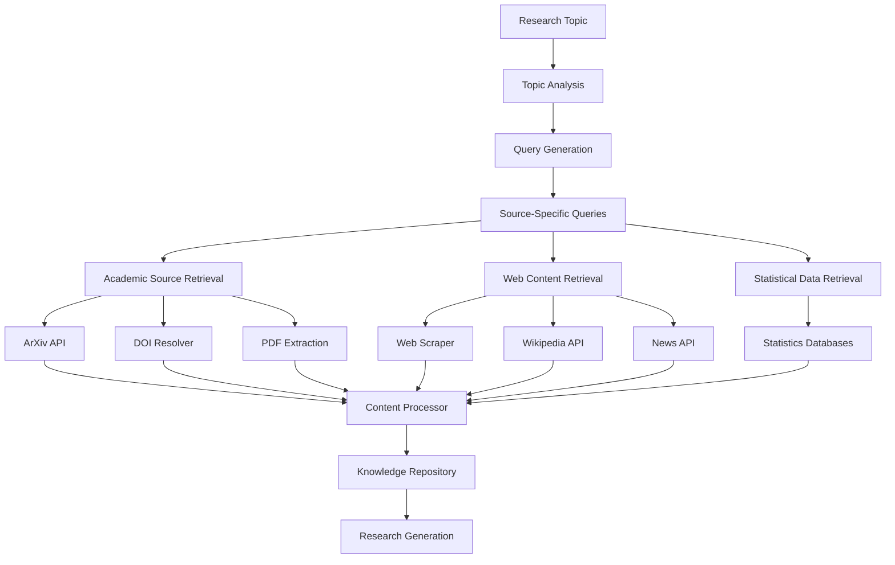
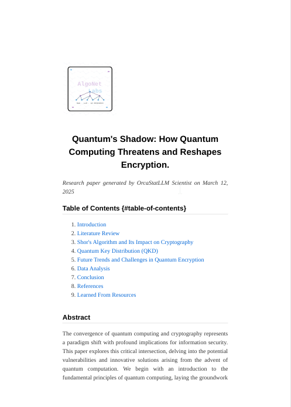
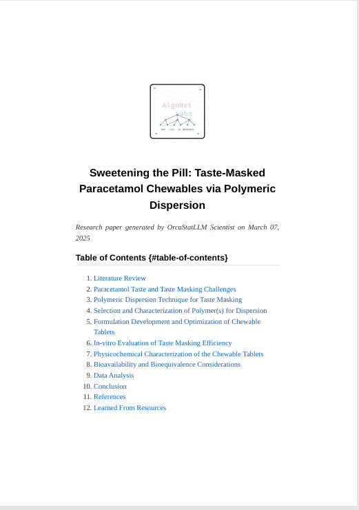
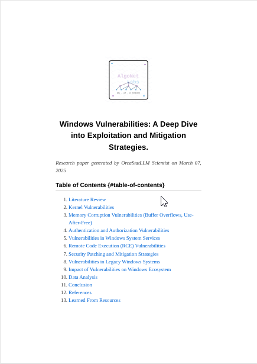

<a name="top"></a>
[](https://algonet.open-research.tech/)
[](https://python.org)
[](#)
[](#-license)

⭐ Star us on GitHub

> **Disclaimer: Research Use Only**
>
> The research papers generated by OrcaStatLLM Researcher are intended solely for educational and informational purposes to illustrate structural formats and provide conceptual insights. These papers are not to be used for publication or formal dissemination. Users are advised to critically evaluate and verify the content, as the generated material may not undergo rigorous peer review. The views and interpretations expressed are those of the authors and do not necessarily reflect the official positions or policies of any affiliated institutions.


## Table of Contents

- [About](#about)
  - [What is OrcaStatLLM Researcher?](#orcastatllm-researcher)
  - [OrcaStatLLM Architecture](#orcastatllm-architecture)
  - [Information Retrieval Process](#retrieval-architecture)
- [Installation](#installation)
  - [Prerequisites](#prerequisites)
  - [Setup Guide](#setting-up)
  - [Common Troubleshooting](https://github.com/AlgoNetLab/OrcaStatLLM-Researcher/blob/main/Common%20Troubleshooting%20Guide.md)
- [Examples & Demos](#example-demos)
- [Contributing](#contributing)

<br/><br/>

# About

## OrcaStatLLM Researcher

OrcaStatLLM Researcher is a self-contained research system that employs a multi-agent architecture powered by large language model. It orchestrates information gathering from academic repositories, statistical databases, and web sources, and then applies natural language processing for content filtering, relevance ranking, and knowledge synthesis. The system follows a modular pipeline architecture with specialized components for academic paper analysis, statistical data extraction, and visualization generation. Operating either as a fully autonomous agent or interactive research aide, it produces semantically rich documents with proper citation management and data visualization, leading to significant productivity improvement in research workflows without compromising stringent academic rigor.

## OrcaStatLLM Architecture


## Retrieval Architecture

The retrieval system operates through specialized modules that target different information sources:



# Installation
This guide will help you get up and running with OrcaStatLLM in minutes.

## Prerequisites

- Gemini API Key (Can be retrived from https://aistudio.google.com/)
- Google CSE API Key (https://console.cloud.google.com/apis/dashboard)
``` yaml
Step-1: Create a Custom Search Engine on https://cse.google.com
Step-2: Add Those on config.json

//
{
  "gemini_api_keys": ["key1", "optionalkey2"],
  "google_cse": [
    {"cse_api": "key1", "cseid": "cse1"},
    {"cse_api": "key2optional", "cseid": "cse2optional"}
  ]
}


//

```
- Dependency Fixer (Fixes and install's all Dependency)

```
chmod +x install-dep.sh
sudo ./install-dep.sh
```

or install manually

```
sudo apt-get update && sudo apt-get install -y \
    build-essential \
    libpq-dev \
    curl \
    libnss3 \
    libnspr4 \
    libdbus-1-3 \
    libcups2 \
    libxcomposite1 \
    libxdamage1 \
    libxext6 \
    libxfixes3 \
    libxrandr2 \
    libgbm1 \
    libxkbcommon0 \
    libcairo2 \
    libasound2 \
    libatspi2.0-0 \
    libpangocairo-1.0-0 \
    libpangoft2-1.0-0 \
    libgdk-pixbuf2.0-0 \
    libgdk-pixbuf-xlib-2.0-0 \
    
sudo pip3 install weasyprint
```

- Playwright
```
$ sudo pip install playwright
$ playwright install-deps
$ playwright install chromium
```
- Pandoc (For PDF Generation)

```bash
$ sudo apt install pandoc
```

## Setting Up

```
$ git clone https://github.com/AlgoNetLab/OrcaStatLLM-Researcher
$ cd OrcaStatLLM-Researcher
$ pip3 install -r requirements.txt
$ python3 run.py 
```

# Example Demos

## Generated Papers

<p>
  <a href="./examples/papers/Quantum_Computi_6110.pdf">
    
  </a> &nbsp;&nbsp;&nbsp;&nbsp;&nbsp;&nbsp;&nbsp;
  <a href="examples/papers/Development_and_7336.pdf">
    
  </a>&nbsp;&nbsp;&nbsp;&nbsp;&nbsp;&nbsp;&nbsp;
  <a href="examples/papers/Windows_Vulnera_4616.pdf">
    
  </a>
  <br>
</p>

## Demo Video

  
[](https://www.youtube.com/watch?v=5gfsbCN-eJ4)


# Contributing

Contributions are welcome! To contribute:

1. Fork the repository.
2. Create a new branch (`git checkout -b feature-branch`).
3. Make your changes and commit them (`git commit -m 'Add new feature'`).
4. Push to your branch (`git push origin feature-branch`).
5. Open a Pull Request.

Thank you for your contributions!


    
